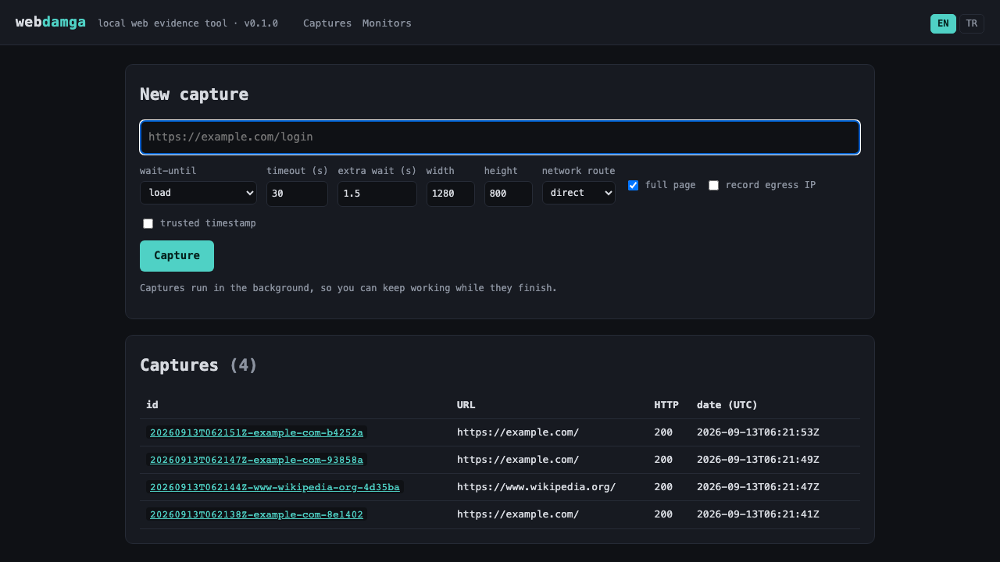
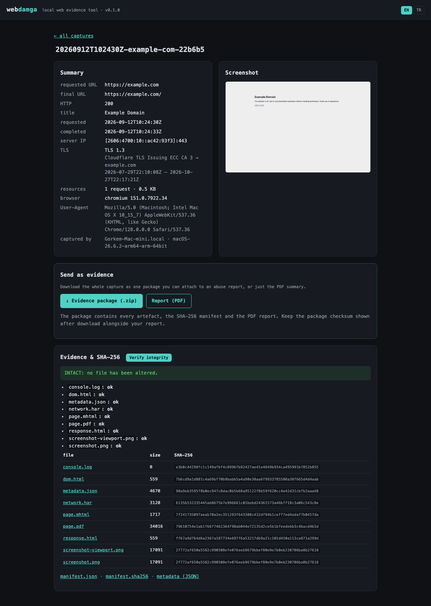

# webdamga

**A local web evidence and archiving tool.** ("damga" is Turkish for
"stamp".) It captures a URL exactly as it looked at a given moment (full
page screenshot, raw + rendered HTML, network traffic, an MHTML archive,
PDF, and console logs) and seals every output with a **SHA-256 integrity
manifest**. Same idea as urlscan.io / archive.today, but focused on
producing evidence you can hold onto, and it runs entirely on `localhost`.

Typical use: recording a phishing page exactly as it appeared, before you
report it (to the registrar, the host, a CERT, a bank), in a form nobody can
say was tampered with.

*[Türkçe README için buraya bakabilirsin](README.tr.md).*

---

## Screenshots

| Start a capture / history | Evidence + SHA-256 verification |
| --- | --- |
|  |  |

---

## Language

The CLI and the web interface both speak **English and Turkish**. English is
the default; Turkish is picked up automatically when your environment or
browser asks for it.

```bash
webdamga --lang tr capture https://example.com   # this run, in Turkish
WEBDAMGA_LANG=tr webdamga --help                 # help text too
```

| Surface | How the language is chosen (first match wins) |
| --- | --- |
| CLI | `--lang` → `WEBDAMGA_LANG` → system locale (`LC_ALL` / `LANG`) → English |
| Web | `?lang=` → `webdamga_lang` cookie → `Accept-Language` → English |

The web interface has an **EN / TR** switch in the top right; the choice is
stored in a cookie, so it sticks. Help text in the CLI is built at startup, so
switching it needs the environment variable rather than `--lang`.

Adding another language means adding one dictionary to
[`webdamga/i18n.py`](webdamga/i18n.py); a test asserts every language defines
exactly the same keys, so nothing can be half translated.

---

## What it produces

Every capture writes the following into `data/captures/<id>/`:

| File | Contents |
| --- | --- |
| `screenshot.png` | Full page screenshot |
| `screenshot-viewport.png` | Above the fold only |
| `response.html` | The main document's **raw HTTP response body** (pre-JS) |
| `dom.html` | The **rendered DOM**, after JS has run |
| `page.mhtml` | A single-file, self-contained archive (opens in Chrome) |
| `page.pdf` | Print to PDF |
| `network.har` | Every request/response, with bodies embedded |
| `console.log` | Console messages plus page errors |
| `metadata.json` | Requested/final URL, redirect chain, HTTP status and headers, server IP, TLS certificate, page title, favicon, UTC timestamps, User-Agent, navigation timing, resource summary, capturing machine |
| `manifest.json` | **SHA-256 of every file above**, plus the tool version |
| `manifest.sha256` | The manifest's own checksum (sidecar) |

`manifest.json` plus `manifest.sha256` is the anchor for proving the folder
hasn't been altered since. `webdamga verify <id>` recomputes both layers.

---

## Installation

Requires Python **3.11+**.

```bash
python3.12 -m venv .venv
source .venv/bin/activate
pip install -e .
python -m playwright install chromium
```

> `playwright install chromium` downloads Chromium (~150 MB) once.

---

## Usage

### CLI

```bash
# Capture a single URL
webdamga capture https://example.com/login

# With options
webdamga capture https://example.com --wait-until networkidle --wait 3 --width 1440

# Recent captures
webdamga list

# Verify a capture's integrity
webdamga verify 20260910T142530Z-example-com-ab12cd

# Package it up to send to someone
webdamga export 20260910T142530Z-example-com-ab12cd
```

`webdamga capture` prints the capture `id`, final URL, HTTP status, server
IP, TLS info, and the `manifest.sha256` checksum. Keeping a copy of that
checksum somewhere else (an email, a report form, a note) lets you prove
later that "this folder is what it was on that day."

### Sending a capture as evidence

`webdamga export <id>` produces one `.zip` you can attach to an abuse report:

```
webdamga-<id>.zip
└── <id>/
    ├── README.txt            what this is, and how to verify it without webdamga
    ├── evidence-report.pdf   readable summary: URLs, TLS, screenshot, checksums
    └── …                     every artefact from the capture, plus the manifest
```

The command prints the package's own SHA-256. Keep it with your report so the
recipient can confirm the file they got is the file you sent.

The recipient does not need this tool. `README.txt` walks them through checking
the artefacts against `manifest.json`, and `manifest.json` against
`manifest.sha256`, with plain `shasum` commands.

`README.txt` and `evidence-report.pdf` are created while packaging, so they are
deliberately not listed in `manifest.json`. Everything else is.

### Web interface

```bash
webdamga serve            # http://127.0.0.1:8000
```

- Enter a URL, capture it
- Browse past captures
- Screenshot, metadata, redirect chain, file list with SHA-256
- A **verify integrity** button
- **Send as evidence**: download the `.zip` package or just the PDF report

### JSON API

| Endpoint | Description |
| --- | --- |
| `GET /api/captures` | Capture index |
| `GET /api/captures/{id}` | A capture's `metadata.json` |
| `GET /captures/{id}/verify` | Integrity check result (JSON) |
| `GET /captures/{id}/files/{name}` | Download a capture file (only names listed in the manifest) |
| `GET /captures/{id}/report.pdf` | PDF evidence report |
| `GET /captures/{id}/export.zip` | Full evidence package; its SHA-256 comes back in the `x-webdamga-package-sha256` header |

---

## Data directory

Defaults to `./data` in the working directory. Override with `--data-dir` or
the `WEBDAMGA_DATA_DIR` environment variable. The index lives in
`data/webdamga.db` (SQLite). `data/` is covered by `.gitignore`.

---

## Tests

```bash
pip install -e ".[dev]"
pytest
```

---

## Roadmap

- [ ] WARC output (Wayback / replay compatible)
- [ ] RFC 3161 / OpenTimestamps trusted timestamping
- [ ] Manifest signing (minisign / age / PGP)
- [ ] Capturing through Tor / a proxy, country selection
- [ ] Comparing two captures of the same URL (visual + DOM diff)
- [ ] Monitoring a URL on a schedule
- [x] PDF evidence report and a sendable `.zip` package
- [ ] A background queue with capture status (so the UI doesn't block)

---

## Legal / ethical note

`webdamga` is meant for **authorized, lawful** use only: monitoring your own
assets, reporting phishing or brand abuse, incident response, academic
research. Complying with applicable law and the target site's terms of
service, when accessing sites you capture and when storing or sharing the
data you collect, is the user's responsibility.

## License

MIT, see [LICENSE](LICENSE).
